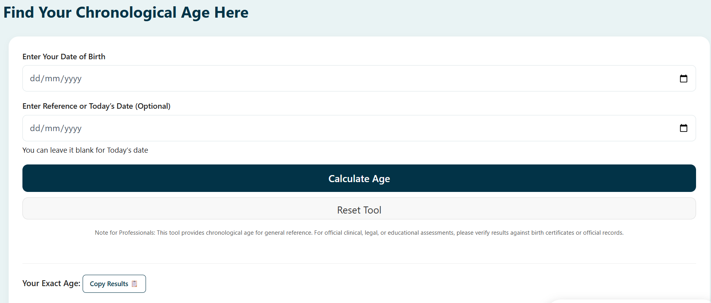

# Chronological Age Calculator

A free and lightweight chronological age calculator built with HTML, CSS, and JavaScript.

This project calculates a person's exact chronological age in **years, months, and days** based on a date of birth and a reference date. It is designed for educational, healthcare, enrollment, eligibility, and general age calculation purposes.

## Features

- Calculate exact chronological age
- Results in years, months, and days
- Custom reference date support
- Responsive and mobile-friendly interface
- Fast and lightweight
- No external libraries or frameworks

## Use Cases

- School enrollment and admissions
- Student age verification
- Healthcare and medical records
- Sports and activity eligibility
- HR and employment age checks
- General age calculations

## Technologies Used

- HTML5
- CSS3
- JavaScript (Vanilla)

## Official Website

🌐 https://chronoagecalculator.com/

## Installation

1. Clone the repository:

```bash
git clone https://github.com/chronoagesite/chrono-age-calculator-web.git
```

2. Open the project folder.

3. Open `index.html` in your browser.

No installation or dependencies are required.

## Screenshot




## Contributing

Suggestions and improvements are welcome. Feel free to open an issue or submit a pull request.

## License

This project is licensed under the MIT License.
